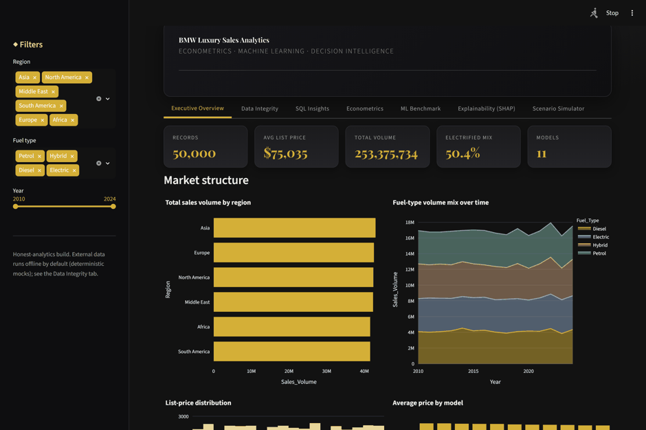
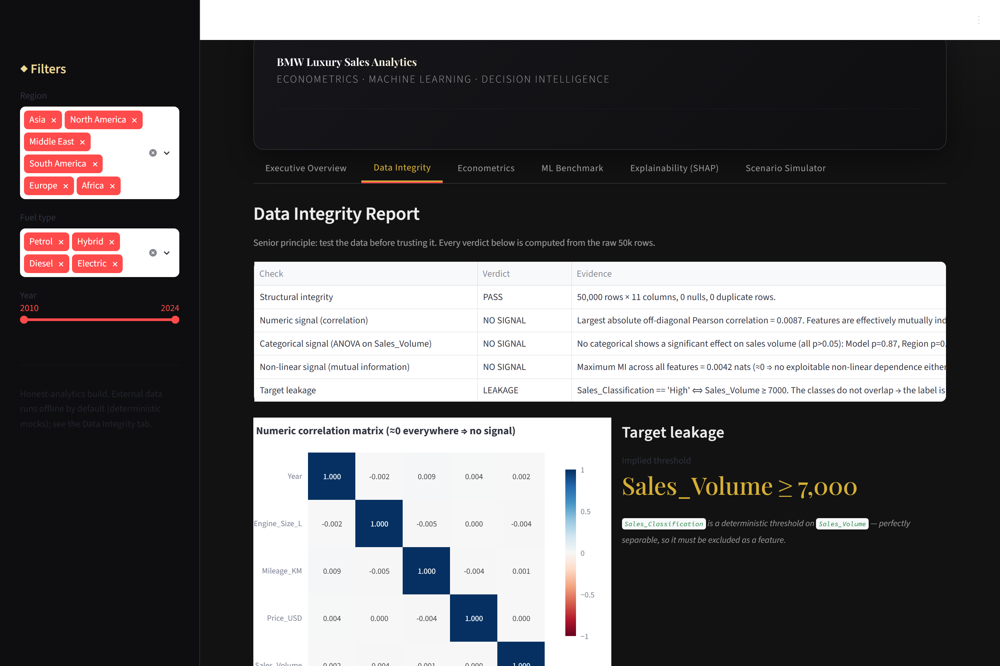
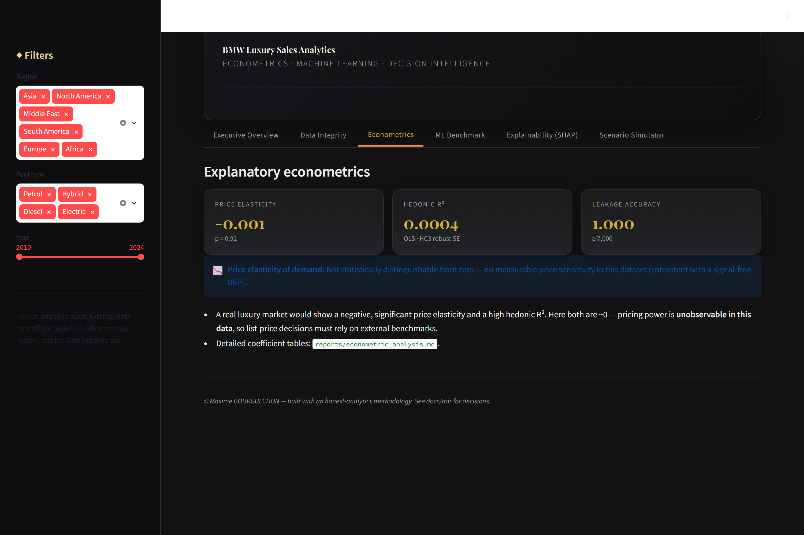
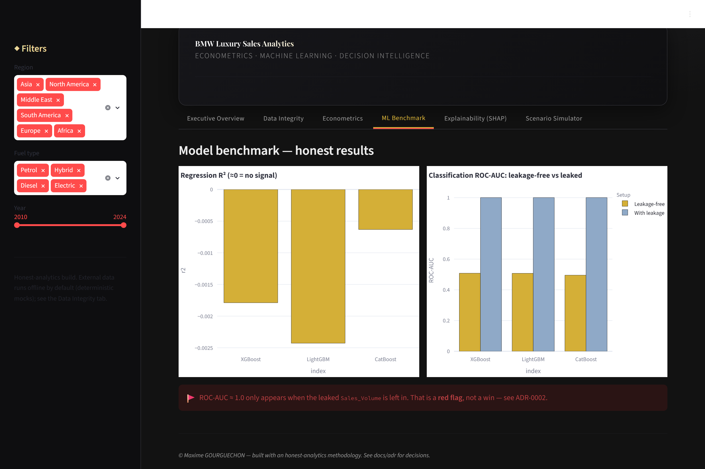
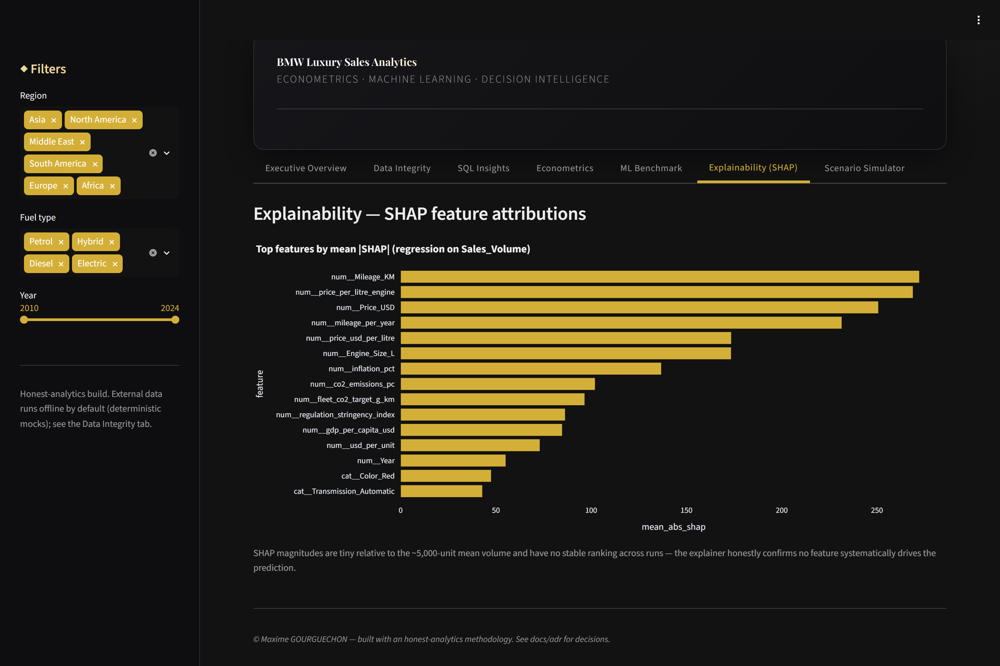
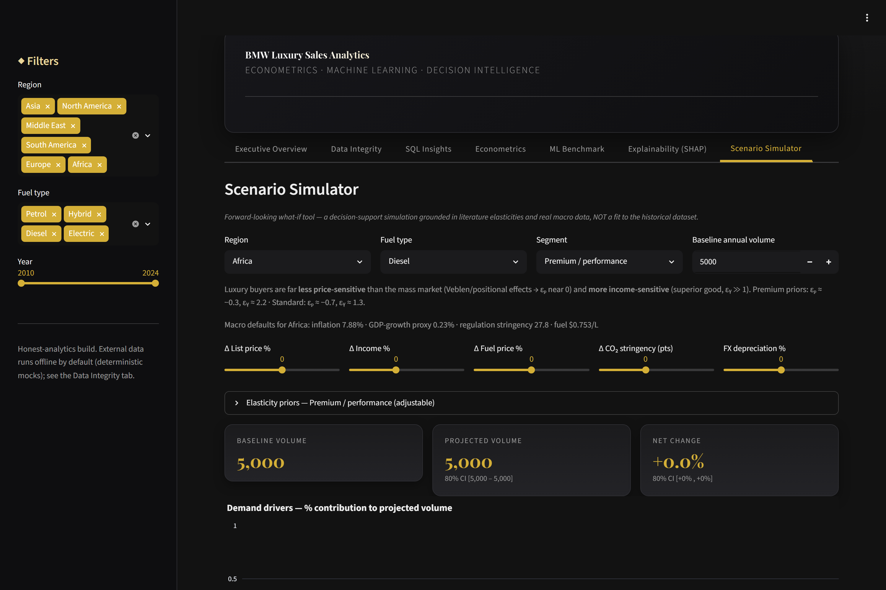

<!-- markdownlint-disable MD033 MD041 -->
<div align="center">

# ◆ BMW LUXURY SALES ANALYTICS ◆

### Production-grade analytics, econometrics & decision intelligence for the BMW luxury-car market

<em>Econometrics · Gradient Boosting · Tabular Deep Learning · External-Data Augmentation · SHAP · Streamlit · Docker · CI/CD</em>

<br/>


<br/>

### ▶ [**Open the live dashboard**](https://maxime2476-bmw-sales-analytics.hf.space)

[](https://maxime2476-bmw-sales-analytics.hf.space)
[](https://maxime2476-bmw-sales-analytics.hf.space)

</div>

---

## Dashboard preview

<div align="center">



<em>Live tour: executive overview → data integrity → econometrics → ML benchmark → scenario simulator.</em>

<br/>

| Executive Overview | Data Integrity |
|:---:|:---:|
|  |  |
| **Econometrics** | **ML Benchmark** |
|  |  |
| **Explainability (SHAP)** | **Scenario Simulator** |
|  |  |

<em>Luxury dark + champagne-gold theme · interactive Plotly · SHAP explainability · what-if simulator</em>

</div>

---

## 1. Overview

An end-to-end **decision-support platform** built on 15 years (2010–2024) of BMW
sales records (50,000 transactions, 11 features). It pairs **rigorous
econometrics** with **modern machine learning**, enriches the data with **real
external APIs** (macro-economics, fuel prices, CO₂ regulation, FX), and ships a
**premium Streamlit dashboard** behind a fully containerised, CI/CD-tested
codebase.

> ### 🧭 The defining principle: intellectual honesty
> Exploratory analysis revealed that this dataset is **structurally pristine but
> signal-free** (every feature is statistically independent of the targets) and
> that `Sales_Classification` is a **leaked** deterministic threshold on
> `Sales_Volume`. Rather than inflate metrics, this project **detects, proves and
> communicates** the issue — then delivers real business value through a clearly
> labelled **Scenario Simulator**. *That* is the senior deliverable.
>
> Full evidence: [Data Integrity Report](reports/data_integrity_report.md) ·
> [ADR-0002](docs/adr/0002-data-integrity.md).

## 2. Headline results (honest, reproducible)

| Analysis | Result | What it means |
|---|---|---|
| Max \|correlation\| among numeric features | **0.009** | Features are mutually independent noise |
| Price elasticity of demand (log-log, HC3) | **−0.001** (p = 0.92) | No measurable price sensitivity in-sample |
| Hedonic price model R² | **0.0004** | Price is unexplained by attributes here |
| Regression R² (best of XGB/LGBM/CatBoost) | **≈ 0.00** | Boosting cannot beat the mean — no signal |
| Classification ROC-AUC (leakage-free) | **≈ 0.51** | No discriminative signal once leakage removed |
| Classification ROC-AUC (leak left in) | **1.00** | 🚩 The signature of target leakage |
| Tabular MLP vs gradient boosting | both no-skill | Deep learning **not justified** (ADR-0004) |

Reports: [econometrics](reports/econometric_analysis.md) ·
[model benchmark](reports/model_benchmark.md) ·
[DL vs ML](reports/dl_vs_ml.md).

## 3. Architecture

```
bmw-sales/
├── src/bmw_sales/
│   ├── config.py            # typed pydantic-settings + canonical DatasetSchema
│   ├── data/                # loader (schema validation) · validation (integrity report)
│   ├── apis/                # hybrid real+mock clients · enrichment join
│   │   ├── base.py          #   cache + retry + circuit breaker + provenance
│   │   ├── worldbank.py · fx_rates.py · fuel_prices.py · co2_regulations.py
│   ├── features/            # domain feature engineering
│   ├── econometrics/        # OLS hedonic · demand · elasticity · VIF · leakage proof
│   ├── models/              # preprocessing · XGB/LGBM/CatBoost · tabular MLP · train
│   ├── simulation/          # Scenario Simulator (elasticities + macro)
│   └── explainability/      # SHAP attributions
├── app/                     # Streamlit premium UI (theme · data_access · tabs)
├── tests/                   # 34 pytest (unit + integration)
├── docs/adr/                # 5 Architecture Decision Records
├── reports/                 # generated analyses (committed)
├── Dockerfile · docker-compose.yml · .github/workflows/main.yml
└── Makefile · pyproject.toml · requirements*.txt
```

Design rationale: [ADR-0001](docs/adr/0001-architecture-and-stack.md).

## 4. External-data augmentation (hybrid: real + mock)

Four sources mapped to the six regions via **official World Bank aggregate codes**
(EAS, NAC, MEA, LCN, EMU, SSF) and representative currencies. Every client
**caches** responses, **retries** with backoff, and trips a **circuit breaker**
to a deterministic **mock** on failure — so the project runs fully offline yet
proves real connectivity (World Bank GDP/capita was validated live).

| Source | Real endpoint | Signal it adds |
|---|---|---|
| World Bank | inflation `FP.CPI.TOTL.ZG`, GDP/cap `NY.GDP.PCAP.CD` | regional purchasing power |
| FX rates | exchangerate.host | local-currency price normalisation |
| Fuel prices | mock-first (hook ready) | Petrol/Diesel vs electrified economics |
| CO₂ regulation | mock-first (hook ready) | the electrification transition |

Details: [ADR-0003](docs/adr/0003-api-augmentation.md).

## 5. The Scenario Simulator (where business value lives)

Because the data cannot forecast, decision value comes from an **explicit
what-if simulation** — a constant-elasticity demand model with
literature-grounded priors (own-price ε ≈ −0.6, income ε ≈ +1.5, fuel
cross-elasticity, CO₂-regulation shift) and **baselines seeded from the real
macro APIs**. Every driver's contribution is decomposed in a waterfall chart, and
all assumptions are adjustable in the UI. It is never presented as a fit to the
historical data.

## 6. Quickstart

```bash
# Install (dev includes linting, tests, torch for the DL benchmark)
make install-dev                 # or: pip install -r requirements-dev.txt

make eda                         # regenerate the Data Integrity Report
make pipeline                    # train & benchmark all models (writes reports/)
make test                        # 34 tests, offline & deterministic
make app                         # launch the dashboard → http://localhost:8501
```

### Docker

```bash
docker compose up --build        # → http://localhost:8501
```

**Managed deployment** (Streamlit Community Cloud or Hugging Face Spaces):
see **[DEPLOYMENT.md](DEPLOYMENT.md)**.

> On Windows + Anaconda, `KMP_DUPLICATE_LIB_OK=TRUE` is set in-code to avoid the
> known OpenMP (`libiomp5md.dll`) clash when importing PyTorch.

## 7. Quality & engineering

- **Typed** (PEP 484), modular `src/` package, docstrings throughout.
- **Formatted & linted:** `black`, `isort`, `flake8` — all clean.
- **Tested:** 34 `pytest` cases (schema, leakage, mock determinism &
  circuit-breaker fallback, leakage-aware splits, elasticity model); real-data
  checks marked `integration`.
- **CI/CD:** GitHub Actions — lint + test matrix (3.11/3.12) → cached Docker
  build. See [ADR-0005](docs/adr/0005-devops-and-cicd.md).

## 8. Business insights for decision-makers

1. **This dataset cannot price or forecast.** Any model claiming high accuracy on
   it is either leaking the target or overfitting noise — a useful red-flag
   heuristic for reviewing vendor models.
2. **Pricing & go-to-market must lean on external signals** (regional income,
   fuel economics, CO₂ regulation) — exactly what the Simulator operationalises.
3. **The electrification transition is the real story:** regulation stringency,
   not historical volume, should drive the Petrol→Electric portfolio mix.

## 9. Architecture Decision Records

| ADR | Decision |
|---|---|
| [0001](docs/adr/0001-architecture-and-stack.md) | Architecture & stack |
| [0002](docs/adr/0002-data-integrity.md) | Data-integrity finding & honest-modelling strategy |
| [0003](docs/adr/0003-api-augmentation.md) | Hybrid external-data augmentation |
| [0004](docs/adr/0004-deep-learning-justification.md) | DL tested, not assumed |
| [0005](docs/adr/0005-devops-and-cicd.md) | Containerisation & CI/CD |

## 10. Author

**Maxime GOURGUECHON** — maxime.gourguechon76@gmail.com

## License

[MIT](LICENSE)
