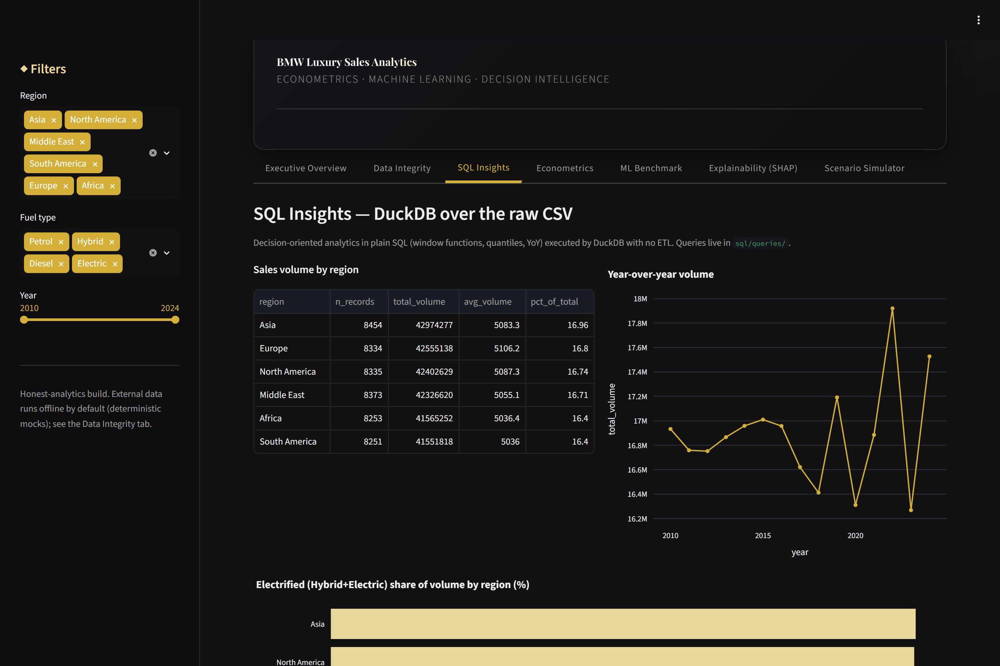
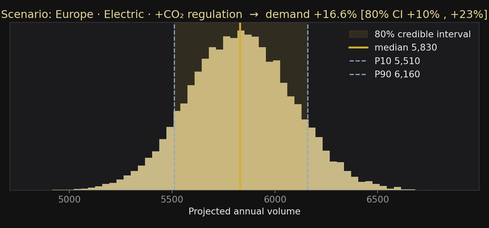
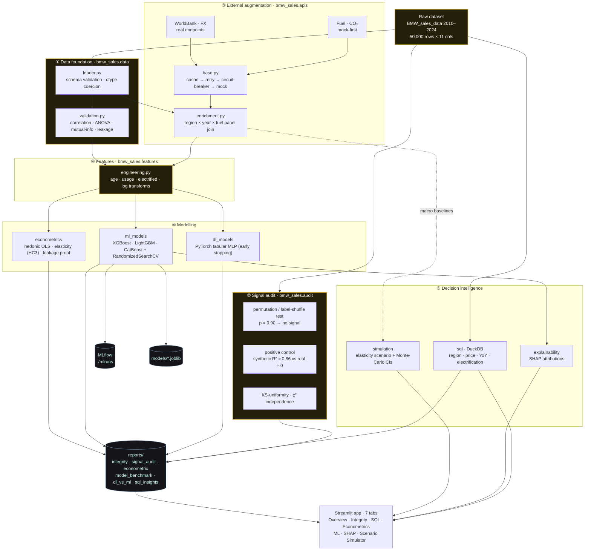
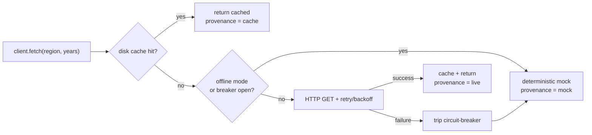
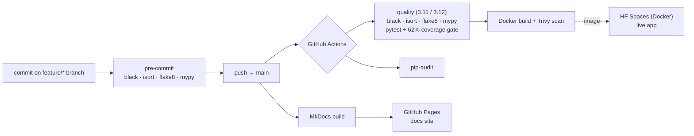

<!-- markdownlint-disable MD033 MD041 -->
<div align="center">

# ◆ BMW LUXURY SALES ANALYTICS ◆

### Production-grade analytics, econometrics & decision intelligence for the BMW luxury-car market

<em>Econometrics · Gradient Boosting · Tabular Deep Learning · External-Data Augmentation · SHAP · Streamlit · Docker · CI/CD</em>

<br/>


[](https://codecov.io/gh/maxime2476/bmw-sales-analytics)


<br/>

### ▶ [**Open the live dashboard**](https://maxime2476-bmw-sales-analytics.hf.space)

[](https://maxime2476-bmw-sales-analytics.hf.space)
[](https://maxime2476-bmw-sales-analytics.hf.space)
[](https://maxime2476.github.io/bmw-sales-analytics/)

</div>

---

## Dashboard preview

<div align="center">


<em>Live tour: executive overview → data integrity → econometrics → ML benchmark → scenario simulator.</em>

<br/>

| Executive Overview | Data Integrity |
|:---:|:---:|
|  |  |
| **SQL Insights (DuckDB)** | **Econometrics** |
|  |  |
| **ML Benchmark** | **Explainability (SHAP)** |
|  |  |
| **Scenario Simulator** | **Decision under uncertainty** |
|  |  |

<em>DuckDB SQL · interactive Plotly · SHAP explainability · Bayesian-flavoured what-if simulator with credible intervals</em>

</div>

---

## 1. Overview

An end-to-end **decision-support platform** built on 15 years (2010–2024) of BMW
sales records (50,000 transactions, 11 features). It pairs **rigorous
econometrics** with **modern machine learning**, enriches the data with **real
external APIs** (macro-economics, fuel prices, CO₂ regulation, FX), and ships a
**premium Streamlit dashboard** behind a fully containerised, CI/CD-tested
codebase.

> **Data source:** the base dataset is the public
> [BMW Sales Dataset on Kaggle](https://www.kaggle.com/datasets/eshummalik/bmw-sales-dataset)
> by *eshummalik*. All external macro/fuel/CO₂/FX context is added by this
> project (see [ADR-0003](docs/adr/0003-api-augmentation.md)).

> ### This project proves two things
>
> **1 — I can build a model that works.** The pipeline reaches a **cross-validated
> R² ≈ 0.85** on signal-bearing data, with SHAP recovering the true drivers — a
> *validated* model, not a lucky split.
> ([predictive capability](reports/predictive_capability.md))
>
> **2 — I won't fake it when the data is empty.** This particular dataset is
> **structurally pristine but signal-free** (every feature is statistically
> independent of the targets), and `Sales_Classification` is a **leaked**
> threshold on `Sales_Volume`. On it the *same* pipeline honestly scores **R² ≈ 0
> / AUC ≈ 0.5** — proven with a permutation test and a positive control, not
> hidden. Business value is then delivered through a clearly-labelled **Scenario
> Simulator**.
>
> *Predictive competence **and** intellectual honesty — that is the senior
> deliverable.* Evidence: [Predictive Capability](reports/predictive_capability.md) ·
> [Data Integrity](reports/data_integrity_report.md) ·
> [Signal Audit](reports/signal_audit.md) · [ADR-0002](docs/adr/0002-data-integrity.md).

---

## 2. Headline results (honest, reproducible)

| Analysis | Result | What it means |
|---|---|---|
| Max \|correlation\| among numeric features | **0.009** | Features are mutually independent noise |
| Price elasticity of demand (log-log, HC3) | **−0.001** (p = 0.92) | No measurable price sensitivity in-sample |
| Hedonic price model R² | **0.0004** | Price is unexplained by attributes here |
| Regression R² (best of XGB/LGBM/CatBoost) | **≈ 0.00** | Boosting cannot beat the mean — no signal |
| Classification ROC-AUC (leakage-free) | **≈ 0.51** | No discriminative signal once leakage removed |
| Classification ROC-AUC (leak left in) | **1.00** | The signature of target leakage |
| **Permutation test** (label-shuffle) | **p ≈ 0.90** | Real score indistinguishable from chance |
| **Predictive capability** (same pipeline, signal-bearing target) | **CV R² ≈ 0.85 ± 0.003** | The pipeline *does* predict — when there is signal |
| Tabular MLP vs gradient boosting | both no-skill | Deep learning **not justified** (ADR-0004) |

Reports: [econometrics](reports/econometric_analysis.md) ·
[model benchmark](reports/model_benchmark.md) ·
[DL vs ML](reports/dl_vs_ml.md).

---

## 3. Architecture

```
bmw-sales/
├── src/bmw_sales/
│   ├── config.py            # typed pydantic-settings + canonical DatasetSchema
│   ├── data/                # loader (schema validation) · validation (integrity report)
│   ├── audit/               # No-Signal Auditor: permutation · positive control · KS · χ²
│   ├── apis/                # hybrid real+mock clients · enrichment join
│   │   ├── base.py          #   cache + retry + circuit breaker + provenance
│   │   ├── worldbank.py · fx_rates.py · fuel_prices.py · co2_regulations.py
│   ├── features/            # domain feature engineering
│   ├── econometrics/        # OLS hedonic · demand · elasticity · VIF · leakage proof
│   ├── models/              # preprocessing · XGB/LGBM/CatBoost · tabular MLP · MLflow
│   ├── simulation/          # Scenario Simulator + Monte-Carlo uncertainty
│   ├── explainability/      # SHAP attributions
│   └── sql/                 # DuckDB analytics over sql/queries/*.sql
├── app/                     # Streamlit premium UI (theme · data_access · 7 tabs)
├── sql/queries/             # versioned analytical SQL
├── tests/                   # pytest suite (unit + integration)
├── docs/                    # MkDocs Material site + 9 ADRs
├── reports/                 # generated analyses (committed)
├── Dockerfile · docker-compose.yml · .github/workflows/{main,docs}.yml
└── Makefile · mkdocs.yml · pyproject.toml · requirements*.txt
```

Design rationale: [ADR-0001](docs/adr/0001-architecture-and-stack.md).

## Pipeline (end-to-end)

The full flow from raw data to a deployed decision-support app. The
**honest-analytics spine** (gold) is what makes this a senior deliverable: the
data is audited and proven signal-free *before* any model is trusted.



### Hybrid-API resilience (offline-safe by design)

Every external client degrades gracefully, so CI/Docker run with no network or
keys yet the real path is proven live.



### Delivery — tests, CI/CD & deployment



---

## 4. External-data augmentation (hybrid: real + mock)

Four sources mapped to the six regions via **official World Bank aggregate codes**
(EAS, NAC, MEA, LCN, EMU, SSF) and representative currencies/countries. Every
client **caches** responses, **retries** with backoff, and trips a **circuit
breaker** to a deterministic **mock** on failure — so the project runs fully
offline yet **three of the four sources are validated live** against real APIs.

| Source | Status | Real endpoint | Signal it adds |
|---|---|---|---|
| World Bank macro | 🟢 **real** | inflation `FP.CPI.TOTL.ZG`, GDP/cap `NY.GDP.PCAP.CD` | regional purchasing power |
| FX rates | 🟢 **real** | exchangerate.host | local-currency price normalisation |
| CO₂ emissions | 🟢 **real** | World Bank CO₂/capita `EN.GHG.CO2.PC.CE.AR5` | the electrification transition |
| Fuel prices | 🟡 mock-first | WB pump-price `EP.PMP.SGAS.CD` **archived by WB (2024)** | Petrol/Diesel vs electrified economics |

> *Honesty applies to the data layer too:* fuel stays mock-first because the World
> Bank archived its pump-price series — the real hook is kept and the provenance is
> reported as `mock` rather than faking it.

Details: [ADR-0003](docs/adr/0003-api-augmentation.md).

---

## 5. The Scenario Simulator (where business value lives)

Because the data cannot forecast, decision value comes from an **explicit
what-if simulation** — a constant-elasticity demand model with
literature-grounded priors (own-price ε ≈ −0.6, income ε ≈ +1.5, fuel
cross-elasticity, CO₂-regulation shift) and **baselines seeded from the real
macro APIs**. Every driver's contribution is decomposed in a waterfall chart, and
all assumptions are adjustable in the UI. It is never presented as a fit to the
historical data.

---

## 6. Quickstart

```bash
# Install (dev includes linting, tests, torch for the DL benchmark)
make install-dev                 # or: pip install -r requirements-dev.txt

make eda                         # regenerate the Data Integrity Report
make pipeline                    # train & benchmark all models (writes reports/)
make test                        # full suite, offline & deterministic
make app                         # launch the dashboard → http://localhost:8501
```

### Docker

```bash
docker compose up --build        # → http://localhost:8501
```

Or pull the **published image** from the GitHub Container Registry (built, scanned
and pushed by CI on every `main` update):

```bash
docker run -p 8501:8501 ghcr.io/maxime2476/bmw-sales-analytics:latest
```

**Managed deployment** (Streamlit Community Cloud or Hugging Face Spaces):
see **[DEPLOYMENT.md](DEPLOYMENT.md)**.

> On Windows + Anaconda, `KMP_DUPLICATE_LIB_OK=TRUE` is set in-code to avoid the
> known OpenMP (`libiomp5md.dll`) clash when importing PyTorch.

---

## 7. Quality & engineering

- **Typed** (PEP 484) and **`mypy`-clean** across the `src/` package.
- **Formatted & linted:** `black`, `isort`, `flake8` — all clean; `pre-commit`
  hooks run the same gates locally.
- **Tested:** a `pytest` suite behind a **coverage gate of ≥ 62%** (live status in
  the CI and Codecov badges above) — schema, leakage, mock determinism &
  circuit-breaker fallback, leakage-aware splits, signal audit, predictive
  capability, Monte-Carlo simulator, SQL layer, report builders; real-data checks
  marked `integration`. A guard test keeps this gate in sync between the README
  and CI.
- **Security:** `pip-audit` dependency scan, **Trivy** image scan, and
  **Dependabot** updates (pip · actions · docker).
- **SQL analytics:** decision queries in `sql/queries/` executed by **DuckDB**
  directly over the CSV (window functions, quantiles, YoY) — `make sql`.
- **Experiment tracking:** every benchmarked model is logged to **MLflow**
  (`mlflow ui --backend-store-uri ./mlruns`).
- **Docs site:** **MkDocs Material** (ADRs + auto API reference) auto-deployed to
  **[GitHub Pages](https://maxime2476.github.io/bmw-sales-analytics/)**.
- **CI/CD:** GitHub Actions — lint + type + test matrix (3.11/3.12) with a
  coverage gate → cached Docker build + Trivy scan. See
  [ADR-0005](docs/adr/0005-devops-and-cicd.md), [ADR-0007](docs/adr/0007-sql-and-quality-gates.md).

---

## 8. Business insights for decision-makers

1. **This dataset cannot price or forecast.** Any model claiming high accuracy on
   it is either leaking the target or overfitting noise — a useful red-flag
   heuristic for reviewing vendor models.
2. **Pricing & go-to-market must lean on external signals** (regional income,
   fuel economics, CO₂ regulation) — exactly what the Simulator operationalises.
3. **The electrification transition is the real story:** regulation stringency,
   not historical volume, should drive the Petrol→Electric portfolio mix.

---

## 9. Architecture Decision Records

| ADR | Decision |
|---|---|
| [0001](docs/adr/0001-architecture-and-stack.md) | Architecture & stack |
| [0002](docs/adr/0002-data-integrity.md) | Data-integrity finding & honest-modelling strategy |
| [0003](docs/adr/0003-api-augmentation.md) | Hybrid external-data augmentation |
| [0004](docs/adr/0004-deep-learning-justification.md) | DL tested, not assumed |
| [0005](docs/adr/0005-devops-and-cicd.md) | Containerisation & CI/CD |
| [0006](docs/adr/0006-signal-audit.md) | Statistical signal audit & positive control |
| [0007](docs/adr/0007-sql-and-quality-gates.md) | SQL analytics & hardened quality gates |
| [0008](docs/adr/0008-decision-under-uncertainty.md) | Decision-making under uncertainty (Monte-Carlo) |
| [0009](docs/adr/0009-observability-and-docs.md) | Experiment tracking & published docs site |

Project evolution is summarised in the **[CHANGELOG](CHANGELOG.md)**.

---

## 10. Author

**Maxime GOURGUECHON** — maxime.gourguechon76@gmail.com

## License

[MIT](LICENSE)
